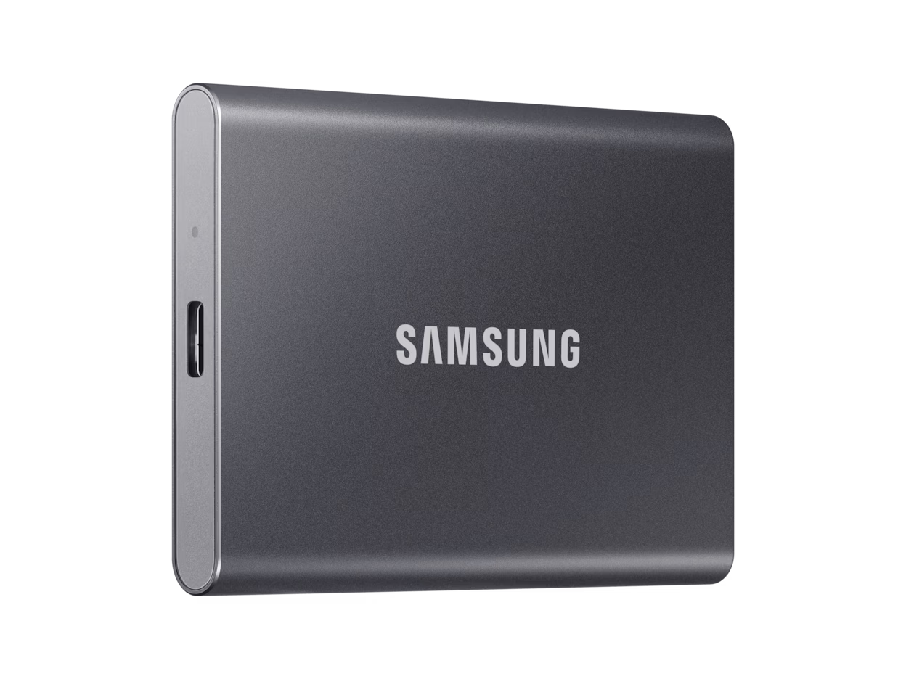
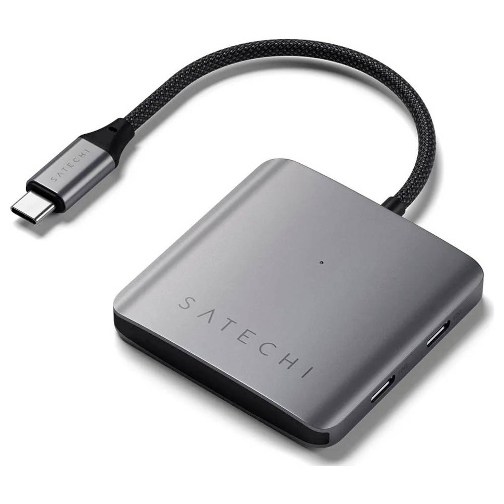
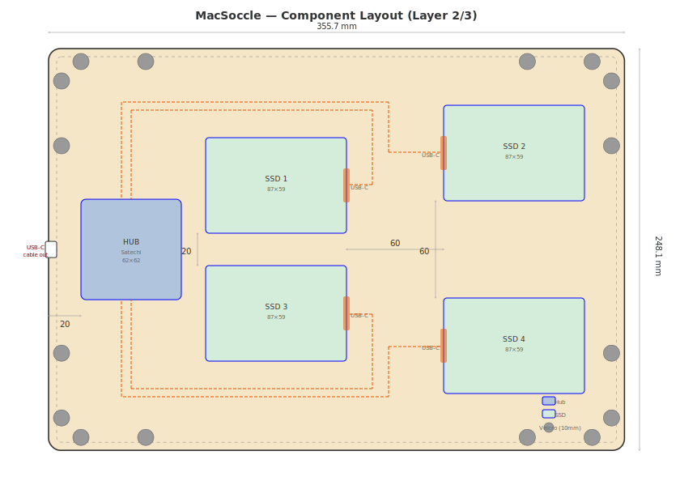
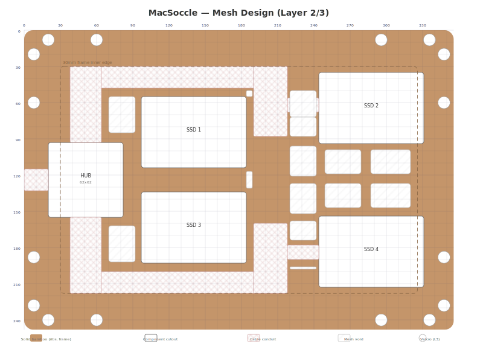

# MacSoccle

A laser-cut bamboo base plate ("socle") for a MacBook Pro 16" M1, with integrated storage for 4 external SSDs and a USB-C hub.

## Concept

A flat horizontal plate that sits under or next to the MacBook Pro, matching its exact footprint and corner rounding. It hides 4 Samsung SSDs and a Satechi USB-C hub inside, connected with short cables, keeping the desk clean.

## Overall dimensions

| Parameter     | Value                                      |
|---------------|--------------------------------------------|
| Width         | 355.7 mm                                   |
| Depth         | 248.1 mm                                   |
| Height        | 16.8 mm                                    |
| Corner radius | ~7.25 mm (matching MacBook Pro 16" rounding, ≈ AA battery radius) |

## Layer stack-up

The plate is built from 4 layers of laser-cut bamboo.
Layers 1-3 are glued together with wood glue. Layer 4 (top) is removable for access to SSDs.

| Layer      | Thickness | Attachment | Function                                   |
|------------|-----------|------------|---------------------------------------------|
| 1 (bottom) | 1.5 mm    | glued      | Solid bottom plate, full footprint         |
| 2          | 5 mm      | glued      | Internal frame with cutouts for components |
| 3          | 5 mm      | glued      | Internal frame with cutouts for components |
| 4 (top)    | 1.5 mm    | velcro     | Removable top plate, full footprint        |

Layer 3 has 16 small holes (10 mm) for velcro dots that connect layer 2 to layer 4 through layer 3. This keeps the velcro inside the stack with no extra height.

* 4 dots on each side, grouped near corners (~20 mm from corner)
* Total: 16 velcro dots (10 mm diameter)

Total height: 1.5 + 5 + 5 + 1.5 = 13 mm (~13 mm + rubber feet)

The two outside layers (1 and 4) are 1.5 mm bamboo plywood for a sleek profile.
The inside faces of layers 1 and 4 are lined with aluminium foil to spread heat from the SSDs and hub.
The two center layers (2 and 3) use a mesh/grid pattern in unused areas to reduce weight.

## Internal components

### Samsung T7 SSD (x4)

> Samsung T7 Portable SSD

{ width=300px }

| Parameter     | Value                                           |
|---------------|-------------------------------------------------|
| Dimensions    | 85 x 57 x 8 mm                                  |
| Cutout needed | 87 x 59 mm per SSD (1 mm clearance)             |
| Total height  | 8 mm (fits within 2 center layers of 5 mm each) |

### Satechi 4-Port USB-C Hub

> Satechi 4-Port USB-C Hub with PD (ST-H4CPDM)

{ width=300px }

| Parameter     | Value                                                    |
|---------------|----------------------------------------------------------|
| Dimensions    | 60 x 60 x 10 mm                                          |
| Cutout needed | 62 x 62 mm (1 mm clearance)                              |
| Total height  | 10 mm (fits exactly within 2 center layers of 5 mm each) |

### Cables

* The 4 SSDs connect to the hub internally using the stock Samsung T7 USB-C cables (45 cm, routed path is ~35 cm)
* Cable channels routed in center layers between hub and SSD positions
* Only the hub's own USB-C cable exits the soccle, from the middle of one short side (works for left or right USB-C ports on the MacBook)

## Component layout

Hub near cable exit (left short side), 4 SSDs in a 2x2 grid to the right.
Hub has 2 USB-C ports on north side (→ SSD1, SSD2) and 2 on south side (→ SSD3, SSD4).
Cables run along the top and bottom edges, on the outside of the SSDs.

## Center layer mesh design

The two center layers (2 and 3) have:
* Component cutouts for SSDs, hub, and hub cable exit
* Cable conduit channels (10mm wide) along top/bottom edges and vertical runs to hub
* Mesh cutouts in all remaining open areas to minimize weight
* Max 10mm solid ribs between cutouts for structural integrity
* 30mm solid frame along all edges
* Layer 3 additionally has 16 velcro holes (10mm)

